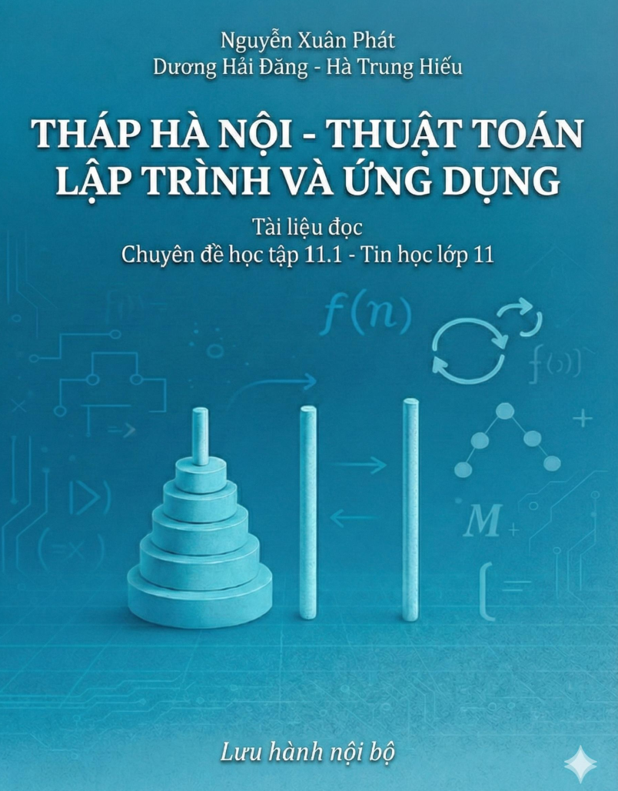

# 📘 README – PTCT_Minhhoa
### *Mô phỏng Tháp Hà Nội – Chuyên đề học tập 11.1 – Tin học lớp 11*

---

## 🎯 Giới thiệu dự án
Dự án **PTCT_Minhhoa** được xây dựng nhằm hỗ trợ giảng dạy và học tập nội dung **Đệ quy – Thuật toán Tháp Hà Nội** trong chương trình **Tin học 11 – Chuyên đề học tập 11.1**.

Website cho phép:

- Giáo viên trình bày bài học với mô phỏng trực quan.  
- Học sinh tự viết thuật toán và quan sát hoạt động của hàm đệ quy.  
- Xem tài liệu hướng dẫn & code chuẩn.  
- Tải tài liệu đọc PDF.  
- Xem video mở đầu bài học (AI Video).  

Tất cả hoạt động ngay trong trình duyệt mà **không cần cài phần mềm phức tạp**.

---

## 📁 Cấu trúc thư mục
```
PTCT_Minhhoa/
│
├── index.html              # Trang chính, chứa 5 tab điều hướng (GV, HS, Guide, PDF, Video)
│
├── hanoi.html              # Chế độ Giảng viên – mô phỏng auto-solve
├── hanoihs.html            # Chế độ Học sinh – nhập thuật toán và xem mô phỏng
├── huongdan.html           # Hướng dẫn + Code chuẩn Tháp Hà Nội
│
├── tailieudoc.html         # Trang tải tài liệu đọc PDF
├── 06_Tailieudoc.pdf       # Tài liệu đọc chính thức
├── Tailieudoc_Image.png    # Ảnh preview bìa PDF
│
├── video_mobai.html        # Video mở đầu bài học (nhúng YouTube)
│
└── README.md               # Tài liệu mô tả dự án (file này)
```

---

## 🧭 Hướng dẫn sử dụng

### 1️⃣ Mở trang chính  
Chạy file:

```
index.html
```

Trang sẽ hiển thị 5 tab:

- 👩‍🏫 Chế độ Giáo viên  
- 🧑‍🎓 Chế độ Học sinh  
- 📗 Hướng dẫn & Code chuẩn  
- 📘 Tài liệu đọc (PDF)  
- 📽 Video mở đầu  

---

## 🧑‍🏫 1. Chế độ Giáo viên – mô phỏng đầy đủ  
**File:** `hanoi.html`

Giáo viên có thể:

- Xem mô phỏng đệ quy từng bước  
- Auto-solve bài toán  
- Gợi ý thuật toán  
- Trình bày nguyên lý đệ quy bằng hình ảnh  

---

## 🧑‍🎓 2. Chế độ Học sinh – viết thuật toán  
**File:** `hanoihs.html`

Học sinh được:

Viết lại hàm:

```js
hanoi(n, from, to, aux, move)
```

- Xem mô phỏng hoạt động đúng/sai  
- Tự rút ra cấu trúc đệ quy  

---

## 📗 3. Hướng dẫn & Thuật toán chuẩn  
**File:** `huongdan.html`

Bao gồm:

- Giải thích thuật toán chuẩn  
- Giải thích từng bước đệ quy  
- Code mẫu  
- Nút sao chép code  

Phù hợp cho phần củng cố cuối bài.

---

## 📘 4. Tải tài liệu đọc (PDF)  
**File:** `tailieudoc.html`  
**PDF:** `06_Tailieudoc.pdf`

Gồm:

- Ảnh preview từ file bìa (`Tailieudoc_Image.png`)  
- Nút tải PDF  
- Tài liệu dùng cho HS tự học và làm dự án  

---

## 🎬 5. Video mở đầu bài học  
**File:** `video_mobai.html`

Video YouTube nhúng để khởi động – giới thiệu tình huống và bài toán đệ quy.

---

## 🛠 Hướng dẫn chỉnh sửa

### 🔧 Thay video mở đầu
Mở file `video_mobai.html`, tìm dòng:

```html
src="https://www.youtube.com/embed/p13KwuufKPs"
```

Thay bằng ID video mới.

---

### 🖼 Thay ảnh preview PDF
Đặt ảnh mới cùng thư mục và sửa:

```html

```

---

### 📄 Thay tài liệu PDF
Đổi file PDF trong cùng thư mục:

```html
onclick="window.location.href='06_Tailieudoc.pdf'"
```

---

## 🌟 Ghi chú dành cho giáo viên

- Trang web chạy được cả offline (chỉ cần mở `index.html`) và online bằng link: https://jwhyhsts.github.io/PTCT_Minhhoa/
- Học sinh chỉ cần mở trình duyệt để học  
- Có thể nhúng vào LMS, Google Classroom…  
- Tối ưu cho trình chiếu khi dạy trên lớp  

---

## ⭐ Ghi chú dành cho học sinh

- Có thể tự viết thuật toán và chạy thử  
- Có thể tải tài liệu PDF để tự nghiên cứu  
- Video mở đầu giúp hiểu rõ bối cảnh và bài toán  

---

## © Bản quyền & Sử dụng

- Tài liệu được dùng **nội bộ** cho môn Tin học lớp 11  
- Giáo viên có thể chỉnh sửa theo nhu cầu giảng dạy  
- Không dùng cho mục đích thương mại  
